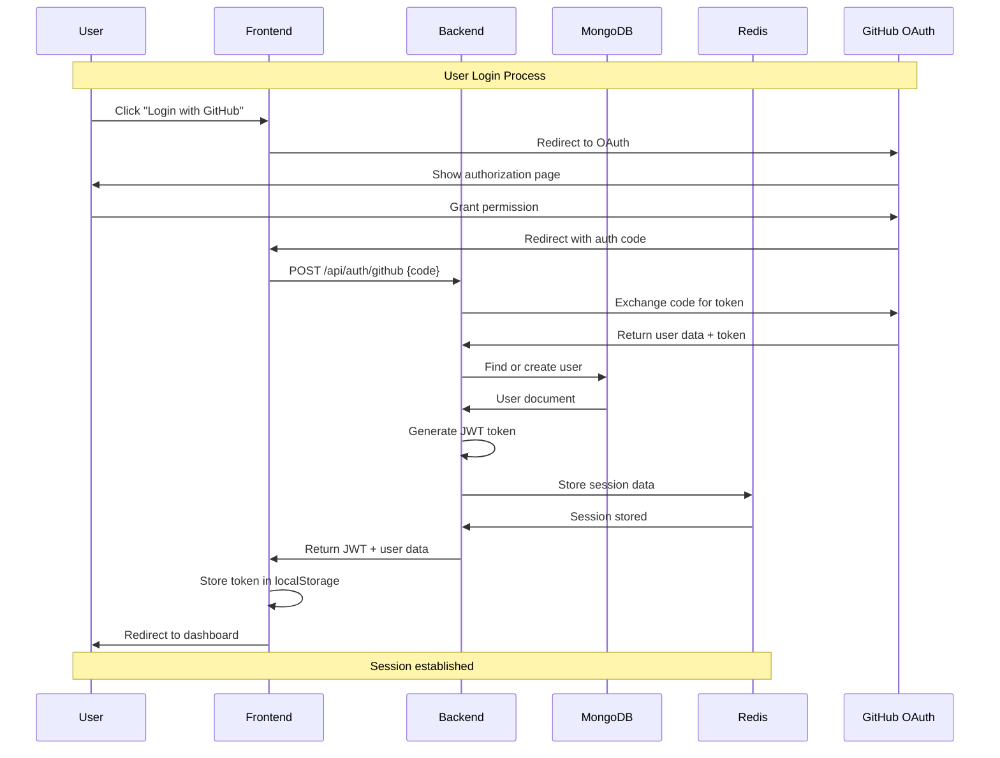
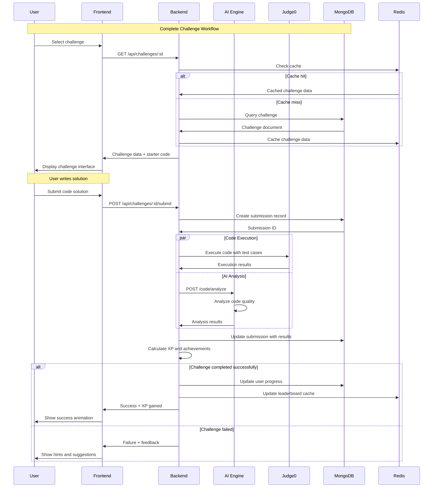
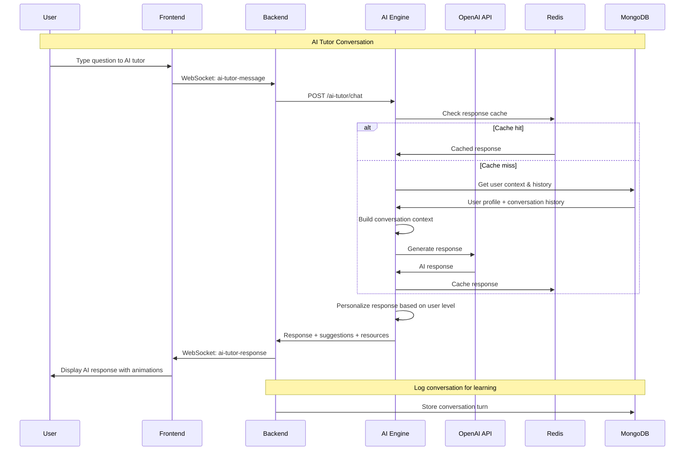
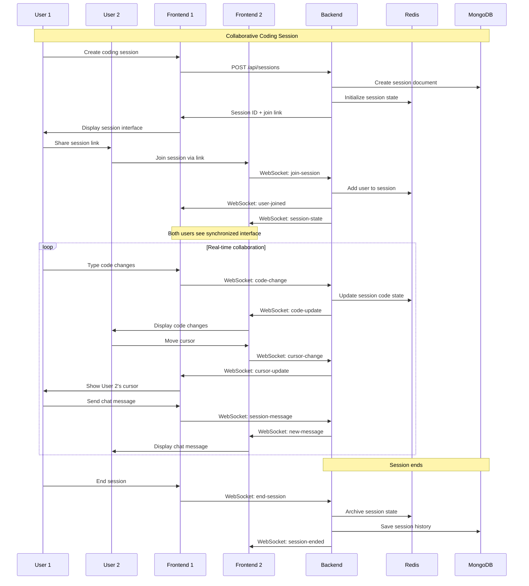
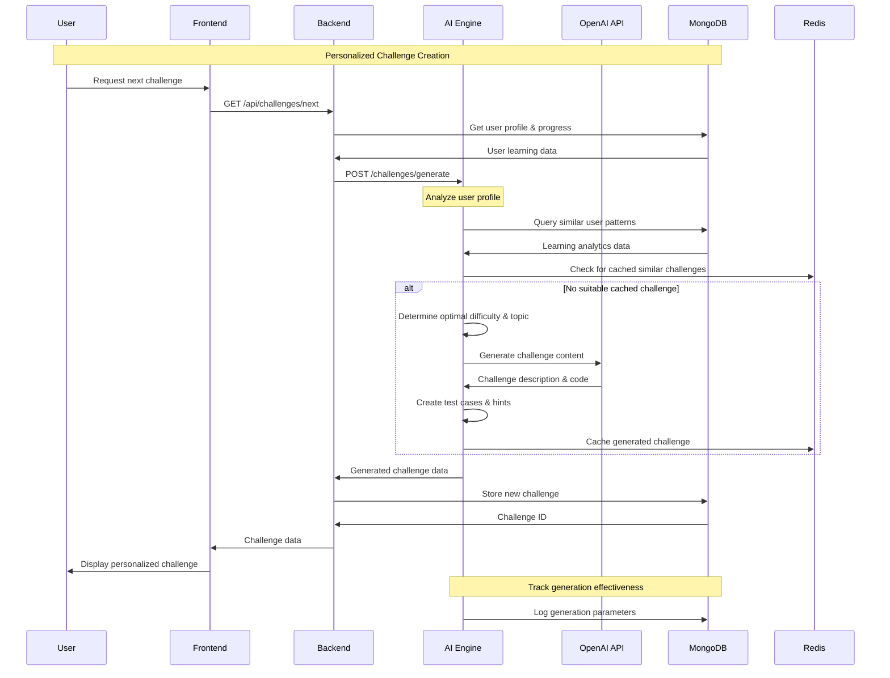
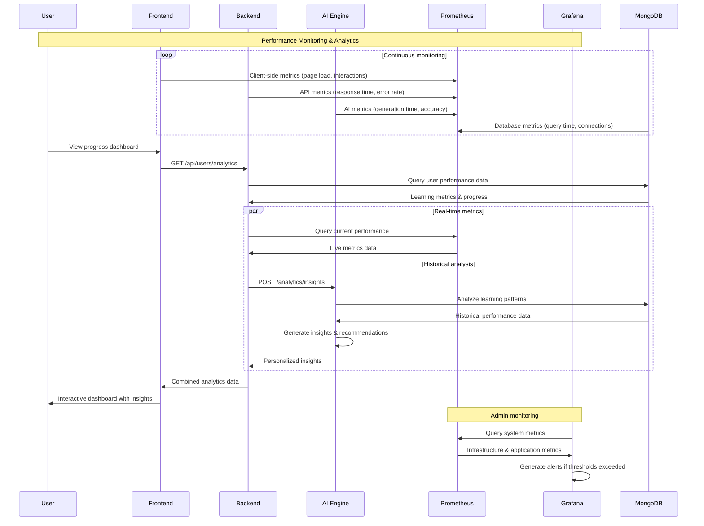
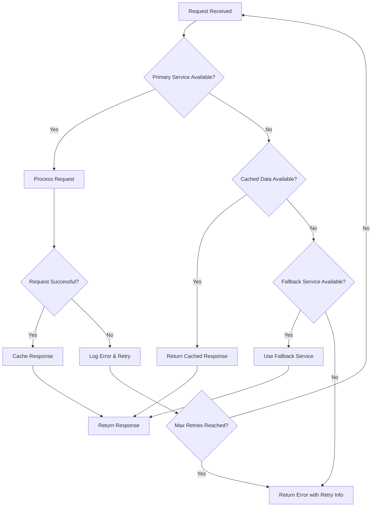

# 📊 Data Flow Architecture

This document illustrates the data flow patterns for key user scenarios in CodeMentor AI, showing how information moves through the system components.

## Key User Scenarios

### 1. User Authentication Flow



### 2. Challenge Solving Flow



### 3. AI Tutor Interaction Flow



### 4. Real-time Collaboration Flow



### 5. Adaptive Challenge Generation Flow



### 6. Performance Analytics Flow



## Data Persistence Patterns

### 1. User Progress Tracking

```javascript
// MongoDB document structure for user progress
{
  userId: ObjectId("..."),
  progressData: {
    totalXP: 2450,
    currentLevel: 8,
    streakDays: 12,
    challengesCompleted: 45,
    
    // Language-specific progress
    languages: {
      python: {
        level: 6,
        xp: 1200,
        challengesCompleted: 25,
        topicsCompleted: ["variables", "loops", "functions", "classes"]
      },
      javascript: {
        level: 4,
        xp: 800,
        challengesCompleted: 15,
        topicsCompleted: ["syntax", "dom", "async"]
      }
    },
    
    // Learning analytics
    analytics: {
      averageTimePerChallenge: 23.5, // minutes
      preferredDifficulty: "medium",
      strongTopics: ["arrays", "hash-tables"],
      improvementAreas: ["dynamic-programming", "graphs"],
      learningVelocity: 1.2 // challenges per day
    }
  },
  
  lastUpdated: ISODate("2024-01-15T10:30:00Z")
}
```

### 2. Real-time Session State

```javascript
// Redis session state structure
{
  sessionId: "session_12345",
  participants: [
    {
      userId: "user_123",
      username: "alice",
      role: "driver", // or "navigator"
      cursorPosition: { line: 15, column: 8 },
      isActive: true
    },
    {
      userId: "user_456", 
      username: "bob",
      role: "navigator",
      cursorPosition: { line: 12, column: 3 },
      isActive: true
    }
  ],
  
  codeState: {
    language: "python",
    code: "def binary_search(arr, target):\n    left = 0\n    right = len(arr) - 1\n    ...",
    lastModified: "2024-01-15T10:35:22Z",
    lastModifiedBy: "user_123"
  },
  
  chatHistory: [
    {
      userId: "user_456",
      username: "bob", 
      message: "Let's use the divide and conquer approach",
      timestamp: "2024-01-15T10:33:15Z"
    }
  ],
  
  sessionMetadata: {
    challengeId: "binary-search-intro",
    startTime: "2024-01-15T10:30:00Z",
    estimatedDuration: 30, // minutes
    isRecording: true
  }
}
```

### 3. AI Response Caching Strategy

```python
# Redis caching for AI responses
cache_key_pattern = "ai_response:{message_hash}:{user_level}:{context_hash}"

# Example cached response
{
  "response": {
    "message": "Great question! Binary search works by...",
    "suggestions": [
      "Try implementing the iterative version first",
      "Consider the edge cases: empty array, single element",
      "Think about the loop invariant"
    ],
    "resources": [
      {
        "title": "Binary Search Visualization",
        "url": "/learn/algorithms/binary-search-viz",
        "type": "interactive"
      }
    ],
    "confidence": 0.92,
    "personalityUsed": "encouraging"
  },
  "metadata": {
    "generatedAt": "2024-01-15T10:34:12Z",
    "modelUsed": "gpt-3.5-turbo",
    "processingTime": 1.2, // seconds
    "cacheExpiry": "2024-01-15T11:34:12Z"
  }
}
```

## Error Handling and Recovery

### 1. Service Failure Recovery



### 2. Data Consistency Patterns

```javascript
// Eventual consistency for non-critical updates
async function updateUserProgress(userId, progressUpdate) {
  try {
    // Primary update
    await mongodb.users.updateOne(
      { _id: userId },
      { $inc: { 'progress.totalXP': progressUpdate.xp } }
    )
    
    // Async cache update (fire and forget)
    redis.hincrby(`user:${userId}:stats`, 'totalXP', progressUpdate.xp)
      .catch(err => logger.warn('Cache update failed', err))
    
    // Async leaderboard update
    updateLeaderboard(userId, progressUpdate.xp)
      .catch(err => logger.warn('Leaderboard update failed', err))
    
  } catch (error) {
    // Queue for retry
    await retryQueue.add('updateUserProgress', { userId, progressUpdate })
    throw error
  }
}
```

---

*This data flow documentation provides detailed insights into how information moves through CodeMentor AI. For database schema details, see [Database Schema](./database-schema.md).*