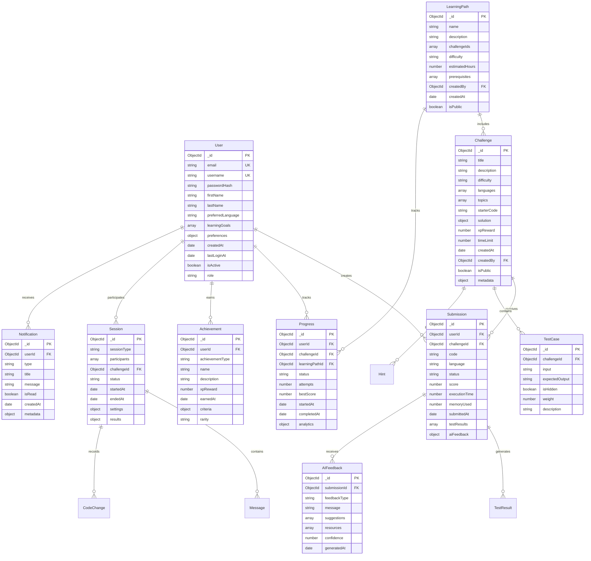

# Database Schema - CodeMentor AI

## Overview

CodeMentor AI uses MongoDB as the primary database for storing user data, challenges, submissions, and learning analytics. This document provides a comprehensive view of the database schema and relationships between collections.

## Entity Relationship Diagram



## Collection Details

### Users Collection

The core user entity storing authentication and profile information.

**Indexes:**
- `email` (unique)
- `username` (unique)
- `createdAt`
- `lastLoginAt`

**Sample Document:**
```json
{
  "_id": ObjectId("..."),
  "email": "john.doe@example.com",
  "username": "johndoe",
  "passwordHash": "$2b$10$...",
  "firstName": "John",
  "lastName": "Doe",
  "preferredLanguage": "python",
  "learningGoals": ["web-development", "algorithms"],
  "preferences": {
    "tutorPersonality": "encouraging",
    "difficultyPreference": "adaptive",
    "notificationSettings": {
      "email": true,
      "push": false
    }
  },
  "createdAt": ISODate("2024-01-15T10:30:00Z"),
  "lastLoginAt": ISODate("2024-01-20T14:22:00Z"),
  "isActive": true,
  "role": "student"
}
```

### Challenges Collection

Programming challenges and coding problems.

**Indexes:**
- `difficulty`
- `languages`
- `topics`
- `createdAt`
- `isPublic`

**Sample Document:**
```json
{
  "_id": ObjectId("..."),
  "title": "Two Sum Problem",
  "description": "Given an array of integers and a target sum, return indices of two numbers that add up to the target.",
  "difficulty": "easy",
  "languages": ["python", "javascript", "java"],
  "topics": ["arrays", "hash-tables"],
  "starterCode": {
    "python": "def two_sum(nums, target):\n    # Your code here\n    pass",
    "javascript": "function twoSum(nums, target) {\n    // Your code here\n}"
  },
  "solution": {
    "python": "def two_sum(nums, target):\n    seen = {}\n    for i, num in enumerate(nums):\n        complement = target - num\n        if complement in seen:\n            return [seen[complement], i]\n        seen[num] = i\n    return []"
  },
  "xpReward": 100,
  "timeLimit": 1800,
  "createdAt": ISODate("2024-01-10T09:00:00Z"),
  "createdBy": ObjectId("..."),
  "isPublic": true,
  "metadata": {
    "estimatedTime": "15-20 minutes",
    "concepts": ["hash tables", "array traversal"],
    "realWorldApplication": "Finding pairs in datasets"
  }
}
```

### Submissions Collection

User code submissions and execution results.

**Indexes:**
- `userId`
- `challengeId`
- `submittedAt`
- `status`
- Compound: `userId + challengeId + submittedAt`

**Sample Document:**
```json
{
  "_id": ObjectId("..."),
  "userId": ObjectId("..."),
  "challengeId": ObjectId("..."),
  "code": "def two_sum(nums, target):\n    seen = {}\n    for i, num in enumerate(nums):\n        complement = target - num\n        if complement in seen:\n            return [seen[complement], i]\n        seen[num] = i\n    return []",
  "language": "python",
  "status": "accepted",
  "score": 100,
  "executionTime": 45,
  "memoryUsed": 2048,
  "submittedAt": ISODate("2024-01-20T15:30:00Z"),
  "testResults": [
    {
      "testCaseId": ObjectId("..."),
      "passed": true,
      "executionTime": 12,
      "output": "[0, 1]",
      "expected": "[0, 1]"
    }
  ],
  "aiFeedback": {
    "overall": "Excellent solution! Clean and efficient implementation.",
    "codeQuality": 95,
    "suggestions": [
      "Consider adding input validation",
      "Great use of hash table for O(n) complexity"
    ]
  }
}
```

### Progress Collection

Tracks user learning progress across challenges and paths.

**Indexes:**
- `userId`
- `challengeId`
- `learningPathId`
- `status`
- Compound: `userId + learningPathId`

### Sessions Collection

Collaborative coding sessions and pair programming.

**Indexes:**
- `participants`
- `challengeId`
- `startedAt`
- `status`

### Learning Paths Collection

Structured learning curricula and course progressions.

**Indexes:**
- `difficulty`
- `createdBy`
- `isPublic`
- `createdAt`

## Data Relationships

### User-Centric Relationships

1. **User → Submissions**: One-to-many relationship tracking all user submissions
2. **User → Progress**: One-to-many relationship tracking learning progress
3. **User → Achievements**: One-to-many relationship for earned badges and rewards
4. **User → Sessions**: Many-to-many relationship for collaborative sessions

### Challenge-Centric Relationships

1. **Challenge → Submissions**: One-to-many relationship for all submissions to a challenge
2. **Challenge → TestCases**: One-to-many relationship for test cases
3. **Challenge → Hints**: One-to-many relationship for progressive hints

### Learning Path Relationships

1. **LearningPath → Challenges**: Many-to-many relationship through challenge IDs array
2. **LearningPath → Progress**: One-to-many relationship tracking user progress

## Performance Considerations

### Indexing Strategy

```javascript
// Critical indexes for performance
db.users.createIndex({ "email": 1 }, { unique: true })
db.users.createIndex({ "username": 1 }, { unique: true })

db.submissions.createIndex({ "userId": 1, "submittedAt": -1 })
db.submissions.createIndex({ "challengeId": 1, "status": 1 })

db.progress.createIndex({ "userId": 1, "learningPathId": 1 })
db.progress.createIndex({ "challengeId": 1, "status": 1 })

db.challenges.createIndex({ "difficulty": 1, "topics": 1 })
db.challenges.createIndex({ "isPublic": 1, "createdAt": -1 })
```

### Query Optimization

- Use projection to limit returned fields
- Implement pagination for large result sets
- Cache frequently accessed challenge data
- Use aggregation pipelines for complex analytics

### Scaling Considerations

- Implement read replicas for analytics queries
- Consider sharding by userId for large user bases
- Archive old submissions to separate collections
- Use MongoDB Atlas for automatic scaling

## Data Migration and Versioning

### Schema Evolution

- Use schema versioning in documents
- Implement backward-compatible changes
- Create migration scripts for breaking changes
- Maintain data consistency during migrations

### Backup Strategy

- Daily automated backups
- Point-in-time recovery capability
- Cross-region backup replication
- Regular backup restoration testing

This schema design supports the full feature set of CodeMentor AI while maintaining performance and scalability for a growing user base.