# 🔄 Service Interaction Architecture

This document details how the microservices in CodeMentor AI communicate with each other, including API contracts, data exchange patterns, and integration points.

## Service Communication Overview

```mermaid
graph TB
    subgraph "Client Layer"
        Browser[🌐 Web Browser]
        Mobile[📱 Mobile App]
    end
    
    subgraph "API Gateway Layer"
        Nginx[🔀 Nginx<br/>Reverse Proxy]
    end
    
    subgraph "Application Layer"
        Frontend[🖥️ Frontend Service<br/>Next.js:3000]
        Backend[🔧 Backend API<br/>Express:3001]
        AIEngine[🧠 AI Engine<br/>Flask:5000]
    end
    
    subgraph "Data Layer"
        MongoDB[(🗄️ MongoDB<br/>:27017)]
        Redis[(⚡ Redis<br/>:6379)]
    end
    
    subgraph "External Services"
        OpenAI[🤖 OpenAI API]
        Judge0[⚖️ Judge0 API]
        GitHub[📚 GitHub API]
    end
    
    subgraph "Infrastructure"
        Prometheus[📊 Prometheus<br/>:9090]
        Grafana[📈 Grafana<br/>:3002]
    end
    
    %% Client connections
    Browser --> Nginx
    Mobile --> Nginx
    
    %% Nginx routing
    Nginx --> Frontend
    Nginx --> Backend
    Nginx --> AIEngine
    
    %% Service interactions
    Frontend -.->|HTTP/WebSocket| Backend
    Backend -.->|HTTP| AIEngine
    Frontend -.->|Direct HTTP| AIEngine
    
    %% Data layer connections
    Backend --> MongoDB
    Backend --> Redis
    AIEngine --> MongoDB
    AIEngine --> Redis
    
    %% External API calls
    AIEngine --> OpenAI
    Backend --> Judge0
    Backend --> GitHub
    
    %% Monitoring
    Prometheus --> Frontend
    Prometheus --> Backend
    Prometheus --> AIEngine
    Grafana --> Prometheus
    
    %% Styling
    classDef clientClass fill:#e3f2fd,stroke:#1976d2,stroke-width:2px
    classDef serviceClass fill:#f3e5f5,stroke:#7b1fa2,stroke-width:2px
    classDef dataClass fill:#e8f5e8,stroke:#388e3c,stroke-width:2px
    classDef externalClass fill:#fff3e0,stroke:#f57c00,stroke-width:2px
    classDef infraClass fill:#fce4ec,stroke:#c2185b,stroke-width:2px
    
    class Browser,Mobile clientClass
    class Frontend,Backend,AIEngine,Nginx serviceClass
    class MongoDB,Redis dataClass
    class OpenAI,Judge0,GitHub externalClass
    class Prometheus,Grafana infraClass
```



## API Communication Patterns

### 1. Frontend ↔ Backend Communication

#### HTTP REST API
```typescript
// Authentication endpoints
POST /api/auth/login
POST /api/auth/register
POST /api/auth/refresh
DELETE /api/auth/logout

// User management
GET /api/users/profile
PUT /api/users/profile
GET /api/users/progress

// Challenge management
GET /api/challenges
GET /api/challenges/:id
POST /api/challenges/:id/submit
GET /api/challenges/:id/submissions

// Real-time features
GET /api/sessions
POST /api/sessions
PUT /api/sessions/:id/join
DELETE /api/sessions/:id/leave
```

#### WebSocket Events
```javascript
// Real-time collaboration
socket.emit('join-session', { sessionId, userId })
socket.on('code-change', { code, userId, timestamp })
socket.on('cursor-update', { position, userId })

// AI tutor interactions
socket.emit('ai-tutor-message', { message, context })
socket.on('ai-tutor-response', { response, suggestions })

// Notifications
socket.on('achievement-unlocked', { achievement, xp })
socket.on('challenge-completed', { challengeId, score })
```

### 2. Backend ↔ AI Engine Communication

#### HTTP API Integration
```python
# AI tutor endpoints
POST /ai-tutor/chat
{
  "message": "How do I implement binary search?",
  "context": {
    "userId": "user123",
    "currentChallenge": "binary-search-intro",
    "userLevel": "intermediate"
  }
}

# Challenge generation
POST /challenges/generate
{
  "userProfile": {
    "level": "intermediate",
    "preferredLanguage": "python",
    "completedTopics": ["arrays", "loops"]
  },
  "topic": "algorithms",
  "difficulty": "medium"
}

# Code analysis
POST /code/analyze
{
  "code": "def binary_search(arr, target):\n    # implementation",
  "language": "python",
  "challengeContext": {
    "challengeId": "binary-search-intro",
    "expectedComplexity": "O(log n)"
  }
}
```

### 3. Service ↔ Database Communication

#### MongoDB Collections Schema
```javascript
// Users collection
{
  _id: ObjectId,
  username: String,
  email: String,
  profile: {
    level: String,
    xp: Number,
    achievements: [ObjectId],
    preferences: {
      language: String,
      tutorPersonality: String,
      learningStyle: String
    }
  },
  createdAt: Date,
  updatedAt: Date
}

// Challenges collection
{
  _id: ObjectId,
  title: String,
  description: String,
  difficulty: String,
  language: String,
  starterCode: String,
  solution: String,
  testCases: [{
    input: String,
    expectedOutput: String,
    hidden: Boolean
  }],
  tags: [String],
  xpReward: Number
}

// Submissions collection
{
  _id: ObjectId,
  userId: ObjectId,
  challengeId: ObjectId,
  code: String,
  language: String,
  status: String, // 'pending', 'accepted', 'wrong_answer', 'error'
  executionTime: Number,
  memoryUsed: Number,
  testResults: [{
    testCaseId: String,
    passed: Boolean,
    output: String,
    error: String
  }],
  submittedAt: Date
}
```

#### Redis Caching Patterns
```javascript
// Session management
SET session:${sessionId} ${JSON.stringify(sessionData)} EX 3600

// API response caching
SET api:challenges:${userId} ${JSON.stringify(challenges)} EX 300

// Rate limiting
INCR rate_limit:${userId}:${endpoint} EX 60

// Real-time collaboration state
HSET collaboration:${sessionId} participants ${JSON.stringify(users)}
HSET collaboration:${sessionId} code ${currentCode}
```

## Service Integration Patterns

### 1. Circuit Breaker Pattern

```javascript
// Backend service with circuit breaker for AI Engine
class AIEngineClient {
  constructor() {
    this.circuitBreaker = new CircuitBreaker(this.callAIEngine, {
      timeout: 5000,
      errorThresholdPercentage: 50,
      resetTimeout: 30000
    })
  }
  
  async generateResponse(message, context) {
    try {
      return await this.circuitBreaker.fire(message, context)
    } catch (error) {
      // Fallback to cached responses or simple rule-based responses
      return this.getFallbackResponse(message, context)
    }
  }
}
```

### 2. Retry with Exponential Backoff

```python
# AI Engine with retry logic for OpenAI API
import backoff

class OpenAIClient:
    @backoff.on_exception(
        backoff.expo,
        (openai.error.RateLimitError, openai.error.APIError),
        max_tries=3,
        max_time=30
    )
    async def generate_completion(self, prompt, context):
        response = await openai.ChatCompletion.acreate(
            model="gpt-3.5-turbo",
            messages=[
                {"role": "system", "content": self.get_system_prompt(context)},
                {"role": "user", "content": prompt}
            ],
            max_tokens=500,
            temperature=0.7
        )
        return response.choices[0].message.content
```

### 3. Event-Driven Architecture

```javascript
// Event emitter for cross-service communication
class EventBus {
  constructor() {
    this.events = new EventEmitter()
  }
  
  // User completes challenge
  emit('challenge.completed', {
    userId: 'user123',
    challengeId: 'binary-search-intro',
    score: 95,
    timeSpent: 1200 // seconds
  })
  
  // AI generates new challenge
  emit('challenge.generated', {
    challengeId: 'new-challenge-456',
    userId: 'user123',
    difficulty: 'medium',
    topic: 'algorithms'
  })
  
  // Achievement unlocked
  emit('achievement.unlocked', {
    userId: 'user123',
    achievementId: 'algorithm-master',
    xpEarned: 500
  })
}
```

## Data Synchronization Strategies

### 1. Real-time Collaboration Sync


### 2. AI Response Caching Strategy

```python
# AI Engine caching strategy
class AIResponseCache:
    def __init__(self, redis_client):
        self.redis = redis_client
        self.cache_ttl = 3600  # 1 hour
    
    async def get_cached_response(self, message_hash, context):
        cache_key = f"ai_response:{message_hash}:{context['userLevel']}"
        cached = await self.redis.get(cache_key)
        
        if cached:
            return json.loads(cached)
        return None
    
    async def cache_response(self, message_hash, context, response):
        cache_key = f"ai_response:{message_hash}:{context['userLevel']}"
        await self.redis.setex(
            cache_key, 
            self.cache_ttl, 
            json.dumps(response)
        )
```

## Error Handling and Resilience

### 1. Service Health Checks

```javascript
// Health check endpoints for each service
app.get('/health', (req, res) => {
  const health = {
    status: 'healthy',
    timestamp: new Date().toISOString(),
    uptime: process.uptime(),
    dependencies: {
      mongodb: await checkMongoConnection(),
      redis: await checkRedisConnection(),
      aiEngine: await checkAIEngineHealth()
    }
  }
  
  const isHealthy = Object.values(health.dependencies)
    .every(dep => dep.status === 'healthy')
  
  res.status(isHealthy ? 200 : 503).json(health)
})
```

### 2. Graceful Degradation

```javascript
// Frontend with graceful degradation
class AITutorService {
  async getResponse(message, context) {
    try {
      // Try AI Engine first
      return await this.aiEngineClient.getResponse(message, context)
    } catch (error) {
      console.warn('AI Engine unavailable, using fallback')
      
      // Fallback to cached responses
      const cached = await this.getCachedResponse(message)
      if (cached) return cached
      
      // Final fallback to static responses
      return this.getStaticResponse(message, context)
    }
  }
}
```

## Performance Optimization

### 1. Connection Pooling

```javascript
// MongoDB connection pooling
const mongoose = require('mongoose')

mongoose.connect(process.env.MONGODB_URI, {
  maxPoolSize: 10, // Maximum number of connections
  serverSelectionTimeoutMS: 5000, // Keep trying to send operations for 5 seconds
  socketTimeoutMS: 45000, // Close sockets after 45 seconds of inactivity
  bufferCommands: false, // Disable mongoose buffering
  bufferMaxEntries: 0 // Disable mongoose buffering
})
```

### 2. Request Batching

```python
# AI Engine request batching
class BatchProcessor:
    def __init__(self, batch_size=10, timeout=1.0):
        self.batch_size = batch_size
        self.timeout = timeout
        self.pending_requests = []
    
    async def process_request(self, request):
        self.pending_requests.append(request)
        
        if len(self.pending_requests) >= self.batch_size:
            return await self.process_batch()
        
        # Wait for more requests or timeout
        await asyncio.sleep(self.timeout)
        if self.pending_requests:
            return await self.process_batch()
    
    async def process_batch(self):
        batch = self.pending_requests[:self.batch_size]
        self.pending_requests = self.pending_requests[self.batch_size:]
        
        # Process all requests in parallel
        results = await asyncio.gather(*[
            self.process_single_request(req) for req in batch
        ])
        
        return results
```

---

*This service interaction documentation provides the technical foundation for understanding how CodeMentor AI's microservices work together. For sequence diagrams of specific user flows, see [Data Flow](./data-flow.md).*