# 🌐 System Overview Architecture

This document provides a high-level view of the CodeMentor AI system architecture, showing all major components and their relationships.

## System Context Diagram

```mermaid
graph TB
    %% External Actors
    Student[👨‍🎓 Student]
    Mentor[👨‍🏫 Mentor]
    Admin[👨‍💼 Admin]
    
    %% External Systems
    OpenAI[🤖 OpenAI API]
    Judge0[⚖️ Judge0 API]
    GitHub[📚 GitHub OAuth]
    
    %% Main System Boundary
    subgraph "CodeMentor AI Platform"
        Frontend[🖥️ Frontend<br/>Next.js 14]
        Backend[🔧 Backend API<br/>Node.js/Express]
        AIEngine[🧠 AI Engine<br/>Python/Flask]
        Database[(🗄️ MongoDB<br/>Database)]
        Cache[(⚡ Redis<br/>Cache)]
        CodeExec[🏃‍♂️ Code Execution<br/>Judge0 Integration]
        Monitor[📊 Monitoring<br/>Prometheus/Grafana]
    end
    
    %% User Interactions
    Student --> Frontend
    Mentor --> Frontend
    Admin --> Frontend
    
    %% Frontend Connections
    Frontend --> Backend
    Frontend --> AIEngine
    
    %% Backend Connections
    Backend --> Database
    Backend --> Cache
    Backend --> AIEngine
    Backend --> CodeExec
    
    %% AI Engine Connections
    AIEngine --> OpenAI
    AIEngine --> Database
    AIEngine --> Cache
    
    %% Code Execution
    CodeExec --> Judge0
    
    %% External Integrations
    Backend --> GitHub
    
    %% Monitoring
    Monitor --> Frontend
    Monitor --> Backend
    Monitor --> AIEngine
    Monitor --> Database
    Monitor --> Cache
    
    %% Styling
    classDef userClass fill:#e1f5fe,stroke:#01579b,stroke-width:2px
    classDef systemClass fill:#f3e5f5,stroke:#4a148c,stroke-width:2px
    classDef externalClass fill:#fff3e0,stroke:#e65100,stroke-width:2px
    classDef dataClass fill:#e8f5e8,stroke:#1b5e20,stroke-width:2px
    
    class Student,Mentor,Admin userClass
    class Frontend,Backend,AIEngine,CodeExec,Monitor systemClass
    class OpenAI,Judge0,GitHub externalClass
    class Database,Cache dataClass
```

## Component Overview

### 🖥️ **Frontend (Next.js 14)**
**Purpose**: User interface and experience layer
- **Technology**: Next.js 14 with App Router, TypeScript, Tailwind CSS
- **Responsibilities**:
  - User authentication and session management
  - Interactive coding challenges interface
  - Real-time collaboration features
  - AI tutor chat interface
  - Progress tracking and gamification UI
  - Responsive design for mobile and desktop

### 🔧 **Backend API (Node.js/Express)**
**Purpose**: Core business logic and API gateway
- **Technology**: Node.js, Express.js, Socket.io
- **Responsibilities**:
  - RESTful API endpoints
  - User authentication and authorization
  - Challenge management and submission handling
  - Real-time WebSocket connections
  - Integration with external services
  - Rate limiting and security middleware

### 🧠 **AI Engine (Python/Flask)**
**Purpose**: Artificial intelligence and machine learning services
- **Technology**: Python, Flask, TensorFlow, scikit-learn
- **Responsibilities**:
  - AI tutor personality and response generation
  - Adaptive challenge creation
  - Code analysis and feedback
  - Learning path recommendations
  - Performance analytics and insights
  - Natural language processing

### 🗄️ **MongoDB Database**
**Purpose**: Primary data persistence layer
- **Technology**: MongoDB 7.0 with Mongoose ODM
- **Data Stored**:
  - User profiles and authentication data
  - Coding challenges and solutions
  - Learning progress and achievements
  - AI tutor conversation history
  - Analytics and usage metrics

### ⚡ **Redis Cache**
**Purpose**: High-performance caching and session storage
- **Technology**: Redis 7.2
- **Use Cases**:
  - Session management
  - API response caching
  - Real-time collaboration state
  - Rate limiting counters
  - Temporary data storage

### 🏃‍♂️ **Code Execution Service**
**Purpose**: Secure code execution environment
- **Technology**: Judge0 API integration
- **Responsibilities**:
  - Sandboxed code execution
  - Multi-language support (Python, JavaScript, Java, C++, etc.)
  - Security isolation
  - Resource limiting
  - Execution result processing

### 📊 **Monitoring Stack**
**Purpose**: System observability and performance tracking
- **Technology**: Prometheus, Grafana, custom metrics
- **Monitoring**:
  - Application performance metrics
  - Infrastructure health
  - User behavior analytics
  - Error tracking and alerting
  - Capacity planning data

## External Integrations

### 🤖 **OpenAI API**
- **Purpose**: Large language model for AI tutor responses
- **Usage**: Natural language generation, code analysis, educational content
- **Fallback**: Local AI models for offline operation

### ⚖️ **Judge0 API**
- **Purpose**: Secure code compilation and execution
- **Usage**: Running user-submitted code in isolated environment
- **Security**: Sandboxed execution with resource limits

### 📚 **GitHub OAuth**
- **Purpose**: User authentication and profile integration
- **Usage**: Single sign-on, repository integration, social features
- **Benefits**: Seamless developer experience

## Data Flow Patterns

### 🔄 **Synchronous Operations**
1. **User Authentication**: Frontend → Backend → Database
2. **Challenge Retrieval**: Frontend → Backend → Database
3. **Code Analysis**: Backend → AI Engine → OpenAI API
4. **Code Execution**: Backend → Judge0 API

### ⚡ **Asynchronous Operations**
1. **Real-time Collaboration**: Frontend ↔ Backend (WebSocket)
2. **AI Response Generation**: Background processing with caching
3. **Progress Updates**: Event-driven notifications
4. **Analytics Collection**: Background data aggregation

## Scalability Considerations

### 🚀 **Horizontal Scaling**
- **Frontend**: CDN distribution, edge caching
- **Backend**: Load balancer with multiple instances
- **AI Engine**: GPU-accelerated instances for ML workloads
- **Database**: MongoDB sharding and replica sets
- **Cache**: Redis clustering

### 📈 **Performance Optimization**
- **API Caching**: Redis for frequently accessed data
- **Database Indexing**: Optimized queries for common operations
- **CDN**: Static asset delivery
- **Lazy Loading**: On-demand resource loading
- **Connection Pooling**: Efficient database connections

## Security Architecture

### 🔐 **Authentication & Authorization**
- **JWT Tokens**: Stateless authentication
- **Role-Based Access**: Student, Mentor, Admin roles
- **OAuth Integration**: GitHub social login
- **Session Management**: Secure session handling

### 🛡️ **Data Protection**
- **Encryption**: TLS 1.3 for data in transit
- **Database Security**: Encrypted storage, access controls
- **Input Validation**: Comprehensive sanitization
- **Rate Limiting**: API abuse prevention

### 🏰 **Code Execution Security**
- **Sandboxing**: Isolated execution environment
- **Resource Limits**: CPU, memory, time constraints
- **Network Isolation**: No external network access
- **File System**: Read-only access to system files

---

*This system overview provides the foundation for understanding CodeMentor AI's architecture. For detailed component interactions, see [Service Interaction](./service-interaction.md) and [Data Flow](./data-flow.md) documentation.*