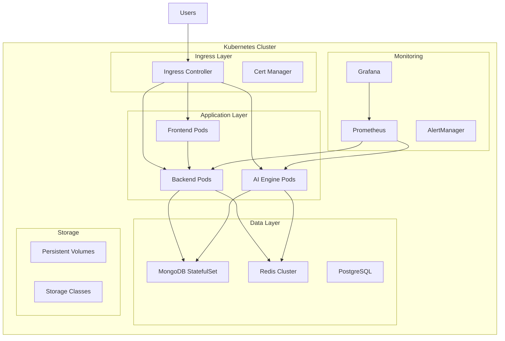

# Kubernetes Deployment Guide

## Overview

This guide covers deploying CodeMentor AI on Kubernetes for production environments that require high availability, auto-scaling, and enterprise-grade reliability.

## Prerequisites

- Kubernetes cluster (v1.24+)
- kubectl configured
- Helm 3.8+
- Ingress controller (nginx-ingress recommended)
- Cert-manager for SSL certificates
- Persistent storage class

## Architecture Overview



## Namespace Setup

```yaml
# namespace.yaml
apiVersion: v1
kind: Namespace
metadata:
  name: codementor-ai
  labels:
    name: codementor-ai
    environment: production
---
apiVersion: v1
kind: ResourceQuota
metadata:
  name: codementor-ai-quota
  namespace: codementor-ai
spec:
  hard:
    requests.cpu: "10"
    requests.memory: 20Gi
    limits.cpu: "20"
    limits.memory: 40Gi
    persistentvolumeclaims: "10"
    services: "10"
    secrets: "20"
    configmaps: "20"
```

## ConfigMaps and Secrets

### Application Configuration

```yaml
# configmap.yaml
apiVersion: v1
kind: ConfigMap
metadata:
  name: codementor-ai-config
  namespace: codementor-ai
data:
  NODE_ENV: "production"
  API_PORT: "3001"
  AI_ENGINE_PORT: "5000"
  MONGODB_URI: "mongodb://mongodb-service:27017/codementor-ai"
  REDIS_URL: "redis://redis-service:6379"
  CORS_ORIGIN: "https://codementor-ai.com"
  RATE_LIMIT_WINDOW_MS: "900000"
  RATE_LIMIT_MAX_REQUESTS: "100"
  LOG_LEVEL: "info"
  PROMETHEUS_ENABLED: "true"
---
apiVersion: v1
kind: Secret
metadata:
  name: codementor-ai-secrets
  namespace: codementor-ai
type: Opaque
stringData:
  JWT_SECRET: "your-super-secure-jwt-secret-key-here"
  REFRESH_TOKEN_SECRET: "your-refresh-token-secret"
  OPENAI_API_KEY: "your-openai-api-key"
  MONGODB_PASSWORD: "your-mongodb-password"
  REDIS_PASSWORD: "your-redis-password"
  SMTP_PASSWORD: "your-smtp-password"
```

## Database Deployments

### MongoDB StatefulSet

```yaml
# mongodb.yaml
apiVersion: apps/v1
kind: StatefulSet
metadata:
  name: mongodb
  namespace: codementor-ai
spec:
  serviceName: mongodb-service
  replicas: 3
  selector:
    matchLabels:
      app: mongodb
  template:
    metadata:
      labels:
        app: mongodb
    spec:
      containers:
      - name: mongodb
        image: mongo:7.0
        ports:
        - containerPort: 27017
        env:
        - name: MONGO_INITDB_ROOT_USERNAME
          value: "admin"
        - name: MONGO_INITDB_ROOT_PASSWORD
          valueFrom:
            secretKeyRef:
              name: codementor-ai-secrets
              key: MONGODB_PASSWORD
        - name: MONGO_INITDB_DATABASE
          value: "codementor-ai"
        volumeMounts:
        - name: mongodb-data
          mountPath: /data/db
        - name: mongodb-config
          mountPath: /docker-entrypoint-initdb.d
        resources:
          requests:
            memory: "1Gi"
            cpu: "500m"
          limits:
            memory: "2Gi"
            cpu: "1000m"
        livenessProbe:
          exec:
            command:
            - mongosh
            - --eval
            - "db.adminCommand('ping')"
          initialDelaySeconds: 30
          periodSeconds: 10
        readinessProbe:
          exec:
            command:
            - mongosh
            - --eval
            - "db.adminCommand('ping')"
          initialDelaySeconds: 5
          periodSeconds: 5
      volumes:
      - name: mongodb-config
        configMap:
          name: mongodb-init-config
  volumeClaimTemplates:
  - metadata:
      name: mongodb-data
    spec:
      accessModes: ["ReadWriteOnce"]
      storageClassName: "fast-ssd"
      resources:
        requests:
          storage: 50Gi
---
apiVersion: v1
kind: Service
metadata:
  name: mongodb-service
  namespace: codementor-ai
spec:
  clusterIP: None
  selector:
    app: mongodb
  ports:
  - port: 27017
    targetPort: 27017
```

### Redis Cluster

```yaml
# redis.yaml
apiVersion: apps/v1
kind: StatefulSet
metadata:
  name: redis
  namespace: codementor-ai
spec:
  serviceName: redis-service
  replicas: 3
  selector:
    matchLabels:
      app: redis
  template:
    metadata:
      labels:
        app: redis
    spec:
      containers:
      - name: redis
        image: redis:7.2-alpine
        ports:
        - containerPort: 6379
        command:
        - redis-server
        - /etc/redis/redis.conf
        - --requirepass
        - $(REDIS_PASSWORD)
        env:
        - name: REDIS_PASSWORD
          valueFrom:
            secretKeyRef:
              name: codementor-ai-secrets
              key: REDIS_PASSWORD
        volumeMounts:
        - name: redis-data
          mountPath: /data
        - name: redis-config
          mountPath: /etc/redis
        resources:
          requests:
            memory: "512Mi"
            cpu: "250m"
          limits:
            memory: "1Gi"
            cpu: "500m"
        livenessProbe:
          exec:
            command:
            - redis-cli
            - ping
          initialDelaySeconds: 30
          periodSeconds: 10
        readinessProbe:
          exec:
            command:
            - redis-cli
            - ping
          initialDelaySeconds: 5
          periodSeconds: 5
      volumes:
      - name: redis-config
        configMap:
          name: redis-config
  volumeClaimTemplates:
  - metadata:
      name: redis-data
    spec:
      accessModes: ["ReadWriteOnce"]
      storageClassName: "fast-ssd"
      resources:
        requests:
          storage: 10Gi
---
apiVersion: v1
kind: Service
metadata:
  name: redis-service
  namespace: codementor-ai
spec:
  clusterIP: None
  selector:
    app: redis
  ports:
  - port: 6379
    targetPort: 6379
```

## Application Deployments

### Backend Deployment

```yaml
# backend.yaml
apiVersion: apps/v1
kind: Deployment
metadata:
  name: backend
  namespace: codementor-ai
spec:
  replicas: 3
  strategy:
    type: RollingUpdate
    rollingUpdate:
      maxSurge: 1
      maxUnavailable: 0
  selector:
    matchLabels:
      app: backend
  template:
    metadata:
      labels:
        app: backend
      annotations:
        prometheus.io/scrape: "true"
        prometheus.io/port: "3001"
        prometheus.io/path: "/metrics"
    spec:
      containers:
      - name: backend
        image: codementor-ai/backend:latest
        ports:
        - containerPort: 3001
        envFrom:
        - configMapRef:
            name: codementor-ai-config
        - secretRef:
            name: codementor-ai-secrets
        resources:
          requests:
            memory: "512Mi"
            cpu: "250m"
          limits:
            memory: "1Gi"
            cpu: "500m"
        livenessProbe:
          httpGet:
            path: /health
            port: 3001
          initialDelaySeconds: 30
          periodSeconds: 10
        readinessProbe:
          httpGet:
            path: /health
            port: 3001
          initialDelaySeconds: 5
          periodSeconds: 5
        volumeMounts:
        - name: logs
          mountPath: /app/logs
      volumes:
      - name: logs
        emptyDir: {}
---
apiVersion: v1
kind: Service
metadata:
  name: backend-service
  namespace: codementor-ai
spec:
  selector:
    app: backend
  ports:
  - port: 3001
    targetPort: 3001
  type: ClusterIP
```

### Frontend Deployment

```yaml
# frontend.yaml
apiVersion: apps/v1
kind: Deployment
metadata:
  name: frontend
  namespace: codementor-ai
spec:
  replicas: 2
  strategy:
    type: RollingUpdate
    rollingUpdate:
      maxSurge: 1
      maxUnavailable: 0
  selector:
    matchLabels:
      app: frontend
  template:
    metadata:
      labels:
        app: frontend
    spec:
      containers:
      - name: frontend
        image: codementor-ai/frontend:latest
        ports:
        - containerPort: 3000
        env:
        - name: NEXT_PUBLIC_API_URL
          value: "https://api.codementor-ai.com"
        - name: NEXT_PUBLIC_AI_ENGINE_URL
          value: "https://ai.codementor-ai.com"
        resources:
          requests:
            memory: "256Mi"
            cpu: "100m"
          limits:
            memory: "512Mi"
            cpu: "250m"
        livenessProbe:
          httpGet:
            path: /api/health
            port: 3000
          initialDelaySeconds: 30
          periodSeconds: 10
        readinessProbe:
          httpGet:
            path: /api/health
            port: 3000
          initialDelaySeconds: 5
          periodSeconds: 5
---
apiVersion: v1
kind: Service
metadata:
  name: frontend-service
  namespace: codementor-ai
spec:
  selector:
    app: frontend
  ports:
  - port: 3000
    targetPort: 3000
  type: ClusterIP
```

### AI Engine Deployment

```yaml
# ai-engine.yaml
apiVersion: apps/v1
kind: Deployment
metadata:
  name: ai-engine
  namespace: codementor-ai
spec:
  replicas: 2
  strategy:
    type: RollingUpdate
    rollingUpdate:
      maxSurge: 1
      maxUnavailable: 0
  selector:
    matchLabels:
      app: ai-engine
  template:
    metadata:
      labels:
        app: ai-engine
      annotations:
        prometheus.io/scrape: "true"
        prometheus.io/port: "5000"
        prometheus.io/path: "/metrics"
    spec:
      containers:
      - name: ai-engine
        image: codementor-ai/ai-engine:latest
        ports:
        - containerPort: 5000
        envFrom:
        - configMapRef:
            name: codementor-ai-config
        - secretRef:
            name: codementor-ai-secrets
        resources:
          requests:
            memory: "1Gi"
            cpu: "500m"
          limits:
            memory: "2Gi"
            cpu: "1000m"
        livenessProbe:
          httpGet:
            path: /health
            port: 5000
          initialDelaySeconds: 60
          periodSeconds: 10
        readinessProbe:
          httpGet:
            path: /health
            port: 5000
          initialDelaySeconds: 10
          periodSeconds: 5
---
apiVersion: v1
kind: Service
metadata:
  name: ai-engine-service
  namespace: codementor-ai
spec:
  selector:
    app: ai-engine
  ports:
  - port: 5000
    targetPort: 5000
  type: ClusterIP
```

## Ingress Configuration

```yaml
# ingress.yaml
apiVersion: networking.k8s.io/v1
kind: Ingress
metadata:
  name: codementor-ai-ingress
  namespace: codementor-ai
  annotations:
    kubernetes.io/ingress.class: "nginx"
    cert-manager.io/cluster-issuer: "letsencrypt-prod"
    nginx.ingress.kubernetes.io/rate-limit: "100"
    nginx.ingress.kubernetes.io/rate-limit-window: "1m"
    nginx.ingress.kubernetes.io/ssl-redirect: "true"
    nginx.ingress.kubernetes.io/force-ssl-redirect: "true"
    nginx.ingress.kubernetes.io/proxy-body-size: "10m"
    nginx.ingress.kubernetes.io/proxy-connect-timeout: "600"
    nginx.ingress.kubernetes.io/proxy-send-timeout: "600"
    nginx.ingress.kubernetes.io/proxy-read-timeout: "600"
spec:
  tls:
  - hosts:
    - codementor-ai.com
    - www.codementor-ai.com
    - api.codementor-ai.com
    - ai.codementor-ai.com
    secretName: codementor-ai-tls
  rules:
  - host: codementor-ai.com
    http:
      paths:
      - path: /
        pathType: Prefix
        backend:
          service:
            name: frontend-service
            port:
              number: 3000
  - host: www.codementor-ai.com
    http:
      paths:
      - path: /
        pathType: Prefix
        backend:
          service:
            name: frontend-service
            port:
              number: 3000
  - host: api.codementor-ai.com
    http:
      paths:
      - path: /
        pathType: Prefix
        backend:
          service:
            name: backend-service
            port:
              number: 3001
  - host: ai.codementor-ai.com
    http:
      paths:
      - path: /
        pathType: Prefix
        backend:
          service:
            name: ai-engine-service
            port:
              number: 5000
```

## Horizontal Pod Autoscaler

```yaml
# hpa.yaml
apiVersion: autoscaling/v2
kind: HorizontalPodAutoscaler
metadata:
  name: backend-hpa
  namespace: codementor-ai
spec:
  scaleTargetRef:
    apiVersion: apps/v1
    kind: Deployment
    name: backend
  minReplicas: 3
  maxReplicas: 10
  metrics:
  - type: Resource
    resource:
      name: cpu
      target:
        type: Utilization
        averageUtilization: 70
  - type: Resource
    resource:
      name: memory
      target:
        type: Utilization
        averageUtilization: 80
  behavior:
    scaleUp:
      stabilizationWindowSeconds: 60
      policies:
      - type: Percent
        value: 100
        periodSeconds: 15
    scaleDown:
      stabilizationWindowSeconds: 300
      policies:
      - type: Percent
        value: 10
        periodSeconds: 60
---
apiVersion: autoscaling/v2
kind: HorizontalPodAutoscaler
metadata:
  name: ai-engine-hpa
  namespace: codementor-ai
spec:
  scaleTargetRef:
    apiVersion: apps/v1
    kind: Deployment
    name: ai-engine
  minReplicas: 2
  maxReplicas: 8
  metrics:
  - type: Resource
    resource:
      name: cpu
      target:
        type: Utilization
        averageUtilization: 60
  - type: Resource
    resource:
      name: memory
      target:
        type: Utilization
        averageUtilization: 70
```

## Monitoring Setup

### Prometheus Configuration

```yaml
# prometheus.yaml
apiVersion: apps/v1
kind: Deployment
metadata:
  name: prometheus
  namespace: codementor-ai
spec:
  replicas: 1
  selector:
    matchLabels:
      app: prometheus
  template:
    metadata:
      labels:
        app: prometheus
    spec:
      containers:
      - name: prometheus
        image: prom/prometheus:latest
        ports:
        - containerPort: 9090
        volumeMounts:
        - name: prometheus-config
          mountPath: /etc/prometheus
        - name: prometheus-data
          mountPath: /prometheus
        resources:
          requests:
            memory: "1Gi"
            cpu: "500m"
          limits:
            memory: "2Gi"
            cpu: "1000m"
      volumes:
      - name: prometheus-config
        configMap:
          name: prometheus-config
      - name: prometheus-data
        persistentVolumeClaim:
          claimName: prometheus-pvc
---
apiVersion: v1
kind: Service
metadata:
  name: prometheus-service
  namespace: codementor-ai
spec:
  selector:
    app: prometheus
  ports:
  - port: 9090
    targetPort: 9090
```

## Deployment Commands

### Initial Setup

```bash
# 1. Create namespace and RBAC
kubectl apply -f namespace.yaml

# 2. Create secrets and configmaps
kubectl apply -f configmap.yaml

# 3. Deploy databases
kubectl apply -f mongodb.yaml
kubectl apply -f redis.yaml

# 4. Wait for databases to be ready
kubectl wait --for=condition=ready pod -l app=mongodb -n codementor-ai --timeout=300s
kubectl wait --for=condition=ready pod -l app=redis -n codementor-ai --timeout=300s

# 5. Deploy applications
kubectl apply -f backend.yaml
kubectl apply -f frontend.yaml
kubectl apply -f ai-engine.yaml

# 6. Deploy ingress
kubectl apply -f ingress.yaml

# 7. Deploy autoscaling
kubectl apply -f hpa.yaml

# 8. Deploy monitoring
kubectl apply -f prometheus.yaml
```

### Verification

```bash
# Check all pods are running
kubectl get pods -n codementor-ai

# Check services
kubectl get svc -n codementor-ai

# Check ingress
kubectl get ingress -n codementor-ai

# Check HPA status
kubectl get hpa -n codementor-ai

# View logs
kubectl logs -f deployment/backend -n codementor-ai
kubectl logs -f deployment/ai-engine -n codementor-ai

# Port forward for testing
kubectl port-forward svc/frontend-service 3000:3000 -n codementor-ai
kubectl port-forward svc/backend-service 3001:3001 -n codementor-ai
```

### Rolling Updates

```bash
# Update backend image
kubectl set image deployment/backend backend=codementor-ai/backend:v1.1.0 -n codementor-ai

# Check rollout status
kubectl rollout status deployment/backend -n codementor-ai

# Rollback if needed
kubectl rollout undo deployment/backend -n codementor-ai
```

## Backup Strategy

### MongoDB Backup CronJob

```yaml
# backup-cronjob.yaml
apiVersion: batch/v1
kind: CronJob
metadata:
  name: mongodb-backup
  namespace: codementor-ai
spec:
  schedule: "0 2 * * *"  # Daily at 2 AM
  jobTemplate:
    spec:
      template:
        spec:
          containers:
          - name: mongodb-backup
            image: mongo:7.0
            command:
            - /bin/bash
            - -c
            - |
              mongodump --host mongodb-service:27017 \
                --db codementor-ai \
                --gzip \
                --archive=/backup/mongodb-$(date +%Y%m%d_%H%M%S).gz
              
              # Upload to S3 if configured
              if [ ! -z "$AWS_S3_BACKUP_BUCKET" ]; then
                aws s3 cp /backup/ s3://$AWS_S3_BACKUP_BUCKET/mongodb/ --recursive
              fi
            env:
            - name: AWS_S3_BACKUP_BUCKET
              value: "codementor-ai-backups"
            volumeMounts:
            - name: backup-storage
              mountPath: /backup
          volumes:
          - name: backup-storage
            persistentVolumeClaim:
              claimName: backup-pvc
          restartPolicy: OnFailure
```

## Security Considerations

### Network Policies

```yaml
# network-policy.yaml
apiVersion: networking.k8s.io/v1
kind: NetworkPolicy
metadata:
  name: codementor-ai-network-policy
  namespace: codementor-ai
spec:
  podSelector: {}
  policyTypes:
  - Ingress
  - Egress
  ingress:
  - from:
    - namespaceSelector:
        matchLabels:
          name: ingress-nginx
  - from:
    - podSelector: {}
  egress:
  - to:
    - podSelector: {}
  - to: []
    ports:
    - protocol: TCP
      port: 53
    - protocol: UDP
      port: 53
  - to: []
    ports:
    - protocol: TCP
      port: 443
```

### Pod Security Standards

```yaml
# pod-security-policy.yaml
apiVersion: v1
kind: SecurityContext
metadata:
  name: codementor-ai-security-context
spec:
  runAsNonRoot: true
  runAsUser: 1000
  runAsGroup: 1000
  fsGroup: 1000
  seccompProfile:
    type: RuntimeDefault
  capabilities:
    drop:
    - ALL
  allowPrivilegeEscalation: false
  readOnlyRootFilesystem: true
```

This Kubernetes deployment provides enterprise-grade scalability, security, and monitoring for CodeMentor AI.